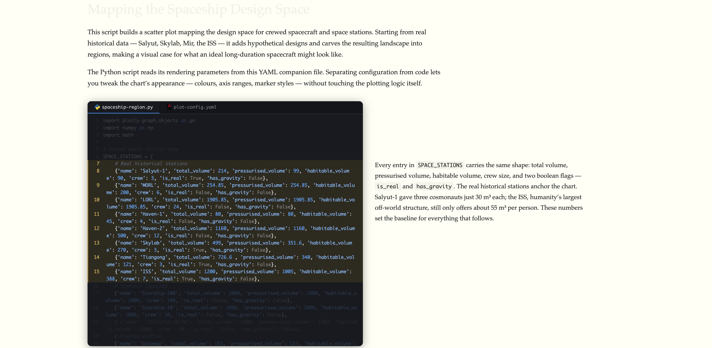

# codetalk



Pin source files alongside markdown prose. As the reader scrolls, the code
pane spotlights the lines being discussed. Useful for walking humans (or AI
agents) through a codebase one region at a time.

A Jekyll plugin plus a small standalone demo build. Drop it into a static
site, or use this repo as a template for standalone annotated code pages.

## Anatomy of the screenshot

The image above shows the default codetalk layout:

- **Top of the page, full width** — the page title (`Mapping the Spaceship
  Design Space`) and the **preamble**: any prose that sits above the first
  `### Lines` heading. Regular body text, one or two paragraphs, sets up
  what the reader is about to see.
- **Left column, dark card** — the **code pane**. A file-tab strip along
  the top (two tabs in this example, `spaceship-region.py` and
  `plot-config.yaml`; clicking a tab swaps what's shown). Below the tabs,
  the source with line numbers. The currently-active range has a soft
  yellow highlight; everything else is dimmed to ~20% opacity. Scrolling
  inside the pane changes which range is active.
- **Right column, body text** — the **prose pane**. Shows exactly one
  step's annotation at a time, vertically positioned to line up with the
  highlighted range on the left. As the reader scrolls the code, the
  prose cross-fades to the next step.

The step shown in the screenshot (lines 7–15 of `spaceship-region.py`, the
`SPACE_STATIONS` array) comes from this markdown in
[`codetalk-1.md`](codetalk-1.md):

~~~markdown
---
title: "Mapping the Spaceship Design Space"
scripts:
  - file: codetalk-1/spaceship-region.py
    label: spaceship-region.py
  - file: codetalk-1/plot-config.yaml
    label: plot-config.yaml
---

## spaceship-region.py

This script builds a scatter plot mapping the design space for crewed spacecraft and
space stations. Starting from real historical data — Salyut, Skylab, Mir, the ISS —
it adds hypothetical designs and carves the resulting landscape into regions, making
a visual case for what an ideal long-duration spacecraft might look like.

### Lines 7-15

Every entry in `SPACE_STATIONS` carries the same shape: total volume, pressurised
volume, habitable volume, crew size, and two boolean flags — `is_real` and
`has_gravity`. The real historical stations anchor the chart. Salyut-1 gave three
cosmonauts just 30 m³ each; the ISS, humanity's largest off-world structure, still
only offers about 55 m³ per person. These numbers set the baseline for everything
that follows.
~~~

A few things to notice in that snippet:

- `scripts:` in the front matter is the full list of files pinned to the
  page. Paths are relative to `_code/`.
- The paragraph right under `## spaceship-region.py` (before any `###
  Lines` heading) is the **preamble** — it renders above the grid, not
  beside a specific line range.
- `### Lines 7-15` creates one **step**. The heading's range (`7-15`)
  becomes the `data-start="7" data-end="15"` on the rendered step and is
  what the scroll spotlight tracks.
- Everything between `### Lines 7-15` and the next `###` (or the next
  `##`, or the end of the file) is that step's annotation.

The full sample file has four steps on `spaceship-region.py` and two on
`plot-config.yaml` — open [`codetalk-1.md`](codetalk-1.md) to see the
whole thing, or `open index.html` to watch it in action.

## Quickstart (standalone, no Jekyll)

See a working example in under a minute:

```bash
git clone https://github.com/angadhn/codetalk.git
cd codetalk
open index.html          # macOS; on Linux use xdg-open, on Windows: start index.html
```

`index.html` is committed pre-built with source code, CSS, and JS all
inlined, so it works from `file://` — no server required.

Then make your own:

1. **Add a source file.** Drop any file you want to annotate into `_code/`,
   e.g. `_code/myproject/server.py`.
2. **Copy `codetalk-1.md` to `myproject.md`** and edit the front matter to
   point at your file, then rewrite the prose — `## <filename>` starts a file
   section; `### Lines N-M` starts a step.

   ```yaml
   ---
   title: "My walkthrough"
   scripts:
     - file: myproject/server.py
       label: server.py
   ---

   ## server.py

   A paragraph above the first `### Lines` heading becomes the preamble —
   regular body text shown above the codetalk grid.

   ### Lines 10-25

   This prose is spotlighted when lines 10–25 are visible in the code pane.

   ### Lines 40-55

   Second step.
   ```

3. **Build.** `build.rb` takes the source markdown as its first argument and
   writes a matching `.html` beside it:

   ```bash
   bundle install                         # one-time; pulls rouge, kramdown, sass-embedded
   bundle exec ruby build.rb myproject.md # writes myproject.html
   open myproject.html
   ```

   With no arguments it rebuilds the sample: `codetalk-1.md` → `index.html`.

### Edit / rebuild loop

Once the initial build works, the inner loop is two commands:

```bash
# edit any of:
#   myproject.md            ← the prose and line ranges
#   _code/myproject/*.py    ← the source being annotated
bundle exec ruby build.rb myproject.md
# then refresh the browser (Cmd-R / Ctrl-R)
```

Nothing is cached — `build.rb` re-reads the markdown, re-highlights every
source file, recompiles the SCSS, and writes a fresh HTML file each run. A
rebuild on the sample takes well under a second.

### Authoring from Obsidian

Obsidian is great for the prose half — live preview, wiki-links, outline
view — but it won't open `.py` / `.yaml` / `.rb` files natively, so you need
a second editor open on the source. The workflow that works well:

1. **Put this repo (or a fork of it) inside your Obsidian vault** as a
   regular folder. Obsidian will index `codetalk-1.md` and any other `.md`
   files you add; it ignores the `_code/` directory's non-markdown contents
   by default.
2. **Open `codetalk-1.md` in Obsidian.** Use live preview or edit mode —
   doesn't matter, the codetalk headings (`## file.py`, `### Lines 10-25`)
   are just regular markdown to Obsidian.
3. **Open the source file in a second editor side by side.** VS Code, a
   terminal editor, or even `Preview` works — you just need line numbers
   visible so you can pick ranges for `### Lines N-M`. Arrange the two
   windows side by side: Obsidian on one half, code editor on the other.
4. **When you change the prose, save the `.md` in Obsidian**, then run
   `bundle exec ruby build.rb codetalk-1.md` in a terminal and refresh the
   browser.
5. **Optional: Obsidian "Shell commands" plugin.** Bind `build.rb` to a
   hotkey so Cmd-B (or whatever) runs the build without switching to the
   terminal. Command template:

   ```
   cd "{{vault_path}}/codetalk" && bundle exec ruby build.rb "{{file_path}}"
   ```

   where `codetalk` is this repo's folder inside your vault.

Why you need the second editor: Obsidian is a markdown-first tool and
deliberately doesn't do syntax highlighting for standalone code files. The
codetalk source files (`_code/codetalk-1/*.py`, etc.) are kept on disk as
plain text, not inside the markdown, precisely so another editor can open
them — and so the markdown stays readable (front matter + prose only, no
giant code blocks inline).

### Authoring syntax cheat sheet

- **`scripts:` front matter** — list of files to pin. Paths are resolved
  relative to `_code/`. A bare basename (no slash) is auto-located by a
  recursive walk of `_code/`.
- **`## <label>`** (h2) — starts a file section. The label must match the
  `label` field in front matter.
- **`### Lines N`** or **`### Lines N-M`** (h3) — starts a step. The range
  drives the scroll spotlight.
- **Preamble** — any prose before the first `### Lines` inside a file
  section. Rendered above the codetalk grid in normal body text.
- **Two blank lines inside a step** — end of annotation, the rest is normal
  body text that resumes after the codetalk block. One blank line = normal
  paragraph break inside the step.
- **Multiple `## <label>` sections back-to-back** — grouped into a single
  codetalk block with tabs. A non-matching h2 or any h1 between them breaks
  the group, which starts a new codetalk block.

## Install into a Jekyll site

The plugin is layout-agnostic: any page or document with `scripts:` in its
front matter gets the codetalk transform, regardless of the `layout:` value.
You do not need to create a dedicated layout.

### One-time setup

1. **Copy the engine files:**

   ```bash
   cp codetalk.rb   <your-site>/_plugins/
   cp codetalk.js   <your-site>/assets/js/
   cp _codetalk.scss <your-site>/_sass/
   ```

2. **Import the SCSS** from your main stylesheet (e.g. `assets/css/main.scss`
   or wherever you `@import` partials):

   ```scss
   @import "codetalk";
   ```

3. **Add `rouge` to your `Gemfile`** (if your theme doesn't already depend on
   it) and `bundle install`:

   ```ruby
   gem 'rouge', '~> 4.0'
   ```

4. **Create the `_code/` directory** at your site root. Source files live
   here. Jekyll ignores directories starting with `_` by default, so these
   files don't get copied verbatim to `_site/` — the plugin reads them at
   build time instead.

That's the install. No layout edits, no `<script>` tags, no `<link>` tags —
the plugin injects `/assets/js/codetalk.js` automatically before `</body>`
on any page that has a codetalk on it.

### Write a codetalk page

Any page or collection document with a `scripts:` key and matching `##`
sections in the body will be transformed. The plugin does not care about the
layout, permalink, or collection. Example:

```markdown
---
title: "My walkthrough"
layout: default         # or post, note, whatever your theme uses
scripts:
  - file: myproject/server.py
    label: server.py
  - file: myproject/config.yaml
    label: config.yaml
---

## server.py

### Lines 10-25

...prose...

## config.yaml

### Lines 1-8

...prose...
```

When Jekyll builds, the two `##` sections above become a two-tab codetalk
block with the source files highlighted by Rouge.

### Dark-theme hosts

The SCSS ships with a `[data-theme="dark"]` block for prose colours. If your
site toggles dark mode via that attribute on `<html>` or `<body>`, it will
"just work." If your site uses a different dark-mode mechanism (class,
media query), override the relevant selectors in your own SCSS.

### Common gotchas

- **`## <label>` must match the `label:` in front matter exactly.** Mismatched
  labels simply don't trigger the transform — the `##` renders as a normal
  heading.
- **Nothing highlights in the preamble.** The preamble is prose that sits
  above the grid; the scroll spotlight only applies to `### Lines` steps.
- **The grid is 140% wide and extends right by default.** This fits a Tufte-
  style narrow-column layout where the body column is ~55% of the viewport.
  If your theme has a full-width content column, tweak the `.codetalk`
  `width` / `margin-right` rules in your site's SCSS.

## How it works

1. **Generator phase** (`Codetalk::CodetalkGenerator` in `codetalk.rb`)
   - Walks pages + collection documents, picks any with `scripts:` set.
   - Preprocesses markdown to convert double-blank-line break markers into a
     `<div class="codetalk-body-break">` sentinel.
   - Reads each referenced source file, syntax-highlights it with Rouge, and
     splits the result into per-line strings with spans re-opened at line
     boundaries so each line is valid standalone HTML.
2. **Post-render hook**
   - Scans the rendered page HTML for `<h2>` tags that match a file label.
   - Groups consecutive matching h2s into a single codetalk block (a
     non-matching h2 or any h1 breaks the group).
   - For each group, rewrites the HTML: file tabs → code panes with
     pre-highlighted lines → prose column with `<div class="codetalk__step">`
     wrappers carrying `data-start` / `data-end`.
   - Converts sidenotes inside steps into footnotes (sidenotes don't fit in
     the narrow prose column).
   - Injects a `<script src="/assets/js/codetalk.js">` before `</body>`.
3. **Client-side** (`codetalk.js`)
   - On scroll, finds the first annotation whose line range intersects the
     visible portion of the code pane. That step's prose is spotlighted;
     all others fade. When the whole codetalk is fully in view, it also dims
     sibling page elements so the reader's attention stays in the block.

## Other static-site generators

Jekyll only, for now. The transform lives in Ruby because Jekyll runs it as
a `:post_render` hook. Ports to Hugo, 11ty, Astro, etc. would need the
transform reimplemented in the host language — PRs welcome. `codetalk.rb`
factors the logic into a plain `Codetalk` module with no Jekyll dependency,
and `build.rb` is a working reference for what a port has to do.

## Files in this repo

| File | Role |
|---|---|
| `codetalk.rb` | `Codetalk` transform module + Jekyll plugin registration |
| `codetalk.js` | Scroll spotlight, tab switching, page-level dimming |
| `_codetalk.scss` | Styles — import into your site's SCSS |
| `build.rb` | Standalone demo builder (no Jekyll needed) |
| `codetalk-1.md` | Sample annotation page |
| `_code/codetalk-1/` | Source files referenced by the sample |
| `index.html` | Pre-built standalone demo (check this in so forkers can open it directly) |
| `Gemfile` | `rouge`, `kramdown`, `kramdown-parser-gfm`, `sass-embedded` |

## License

MIT — see `LICENSE`.
